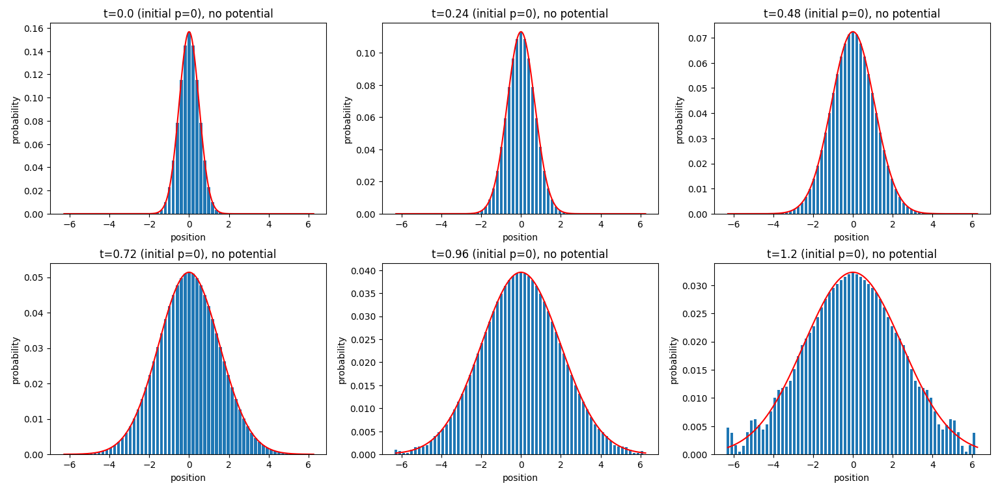
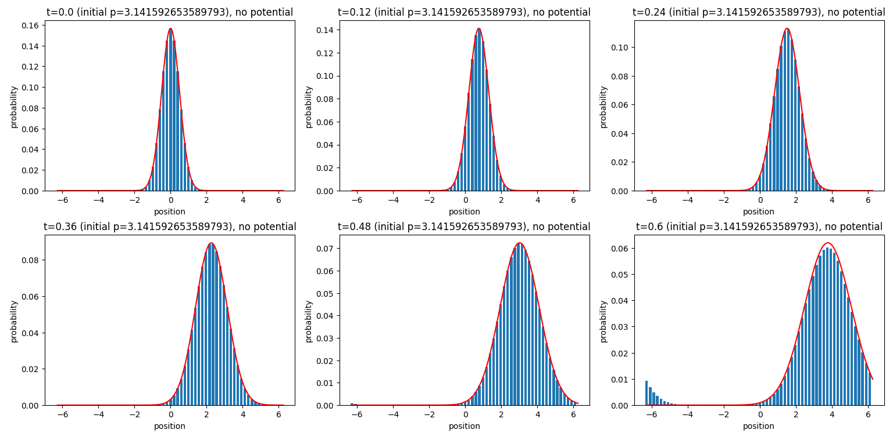
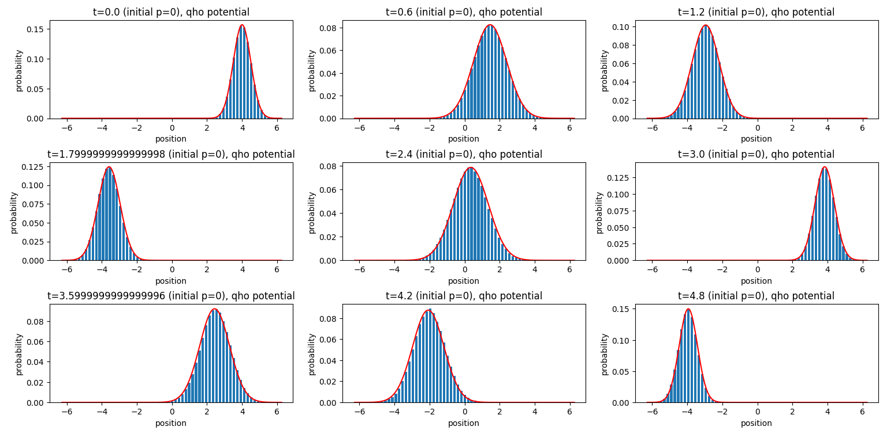

# quantum-sim
This is a collection of Qiskit quantum simulation algorithms implemented by me.
## 1D Schrödinger Equation
In 1d-schrodinger/ I solve a small set of one-dimensional time-dependent Schrödinger equations
$i \hbar \partial_t \psi(x, t) = H \psi(x, t)$, where $H = \frac{-\hbar^2}{2m} \partial_x^2 + V(x)$.
In particular, for simplicity of units, we take $\hbar = 1$ and $m = \frac{1}{2}$, reducing
the equation to $i \partial_t \psi(x, t) = -\partial_x^2 \psi(x, t) + V(x) \psi(x, t)$. Implemented
are the case for a free particle ($V \equiv 0$), and the quantum harmonic oscillator ($V(x) = x^2$),
both with initial state a Gaussian wavepacket.  Along with implementation details, derivations for every 
quantum circuit in the code are given as .tex files, as well as rendered LaTeX [here](1d-schrodinger/written/1dschrodinger.pdf).

In ```approx_sim()```, one can approximate the probability amplitudes of the quantum state after time t
using either a simulator or a physical IBM QPU (depending on choice of backend) and taking measurements.
Alternatively, with solid performance one can extract the probabilites directly with ```exact_sim()```.
Below are extracted probabilities compared against the analytical solution (red curve) for the free particle:
observe the dispersion of the wavepacket. Note that ```approx_sim()``` requires a configured IBM account
and API token if you want to run on quantum hardware.



See that the probabilities match the ideal curve for small t perfectly; since there is no potential term,
we may implement the solution exactly. At large t the simulation begins to break down due to periodic boundary 
conditions in the simulation being incompatible with the assumption of an infinite domain for the wavefunction. One can
see this phenomena more clearly with a free particle of nonzero momentum.



For t large (not shown, but t > 2 should do it), the discretized wavefunction begins interfering with itself, 
leading to very interesting behaviour for a free particle in a ring. Now considering the quantum harmonic oscillator,



The squeezed wavepacket does not disperse the way it does in the zero potential case; it "breathes"
between greater and smaller uncertainty, so we don't have the same interaction with our periodic boundary 
conditions. The error you see here is because we are now approximating the solution using the Trotter formula. 
This can be minimized by taking smaller timesteps (more iterations of the circuit). Following the steps outlined
in the typeset pdf, one could implement a larger set of potentials, but there is nothing theoretically more interesting,
at least with respect to the implementation, to be found there.
## Usage
After installing the required packages, this should work out of the box. One can plug and play values
for momentum, expected value, uncertainty, and which potential to be simulated. Plots of the same form
as in this README will be drawn. The only caveat here is that the analytical solutions are only partially
implemented, but this is detailed briefly in the code.
## Future directions
Next task in the docket is to solve the one-dimensional Dirac equation.