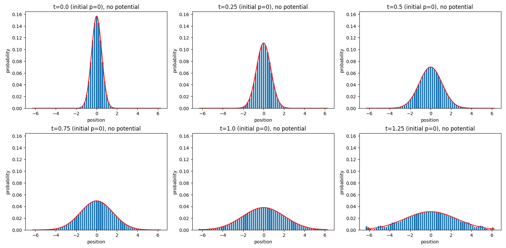
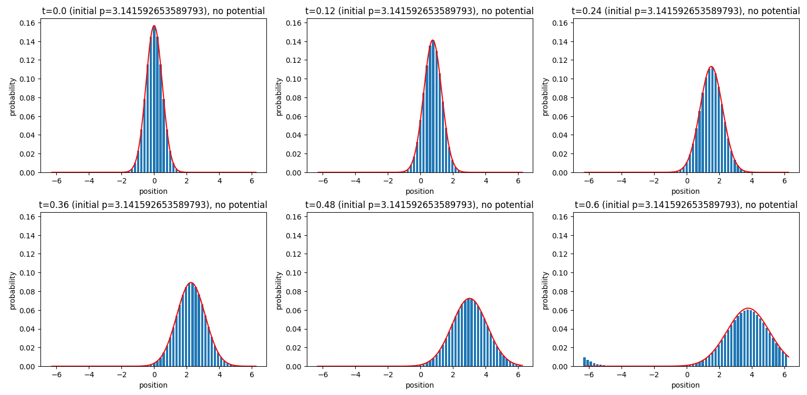
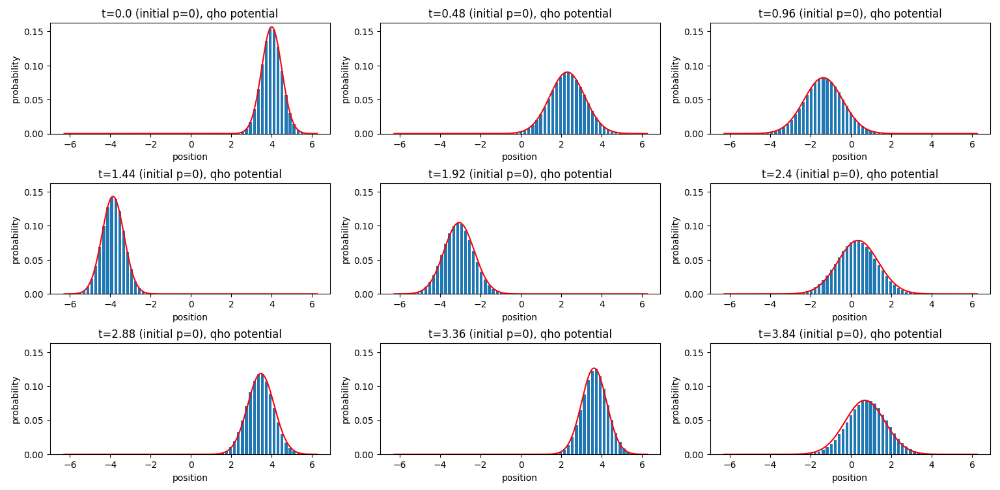
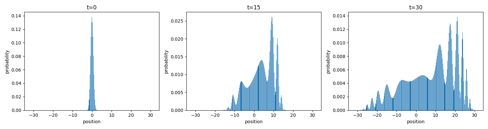
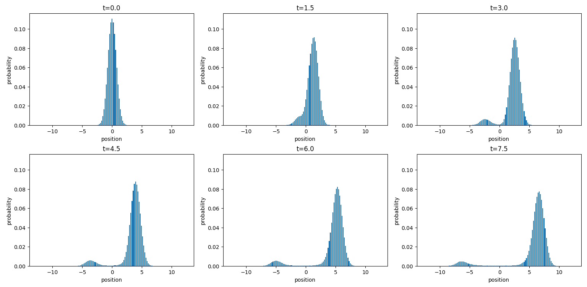

# quantum-sim
This is a collection of Qiskit quantum simulation algorithms implemented by me. Currently written are
solvers for the 1D Schrödinger and Dirac equations.
## Simulation
Simulation of both 1D equations uses a common set of functions implemented in ```1d-sim/src/sim-essentials.py```.
In ```approx_sim()```, one can approximate the probability amplitudes of the quantum state after time t
using either a simulator or a physical IBM QPU (depending on choice of backend) and taking measurements.
Just note that ```approx_sim()``` requires a configured IBM account and API token if you want to run on quantum hardware.
Alternatively, with solid performance one can extract the probabilites directly with ```exact_sim()```.
## 1D Schrödinger Equation
In ```1d-sim/src/schrodinger.py``` I solve a small set of one-dimensional time-dependent Schrödinger equations
$i \hbar \partial_t \psi(x, t) = H \psi(x, t)$, where $H = \frac{-\hbar^2}{2m} \partial_x^2 + V(x)$.
In particular, for simplicity of units, we take $\hbar = 1$ and $m = \frac{1}{2}$, reducing
the equation to $i \partial_t \psi(x, t) = -\partial_x^2 \psi(x, t) + V(x) \psi(x, t)$. Implemented
are the case for a free particle ($V \equiv 0$), and the quantum harmonic oscillator ($V(x) = x^2$),
both with initial state a Gaussian wavepacket.  

Along with implementation details, derivations for every 
quantum circuit in the code are given as .tex files, as well as rendered LaTeX [here](1d-sim/written/schrodinger.pdf).
Below are extracted probabilities compared against the analytical solution (red curve) for the free particle:
observe the dispersion of the wavepacket. 



See that the probabilities match the ideal curve for small t perfectly; since there is no potential term,
we may implement the solution exactly. At large t the simulation begins to break down due to periodic boundary 
conditions in the simulation being incompatible with the assumption of an infinite domain for the wavefunction. 
One can also see this phenomenon with a free particle of nonzero momentum.



For t large (not shown, but t > 2 should do it), the discretized wavefunction begins interfering with itself, 
leading to very interesting behaviour for a free particle in a ring. Now considering the quantum harmonic oscillator,



The squeezed wavepacket does not disperse the way it does in the zero potential case; it "breathes"
between greater and smaller uncertainty, so we don't have the same interaction with our periodic boundary 
conditions. The error you see here is because we are now approximating the solution using the Trotter formula. 
This can be minimized by taking smaller timesteps (more iterations of the circuit). Following the steps outlined
in the typeset pdf, one could implement a larger set of potentials, but there is nothing theoretically more interesting,
at least with respect to the implementation, to be found there.
## 1D Dirac Equation
The Schrödinger equation above accurately describes nonrelativistic quantum particles,
but it does not capture special relativity. To unify these two things, we look to Dirac:
for a potential function $f$, the 1D Dirac equation is given by $i \hbar \partial_t \psi
= (-i \hbar \sigma_x \partial_x + mc^2 \sigma_z + f(x))\psi$. Here $\psi = (\psi_1, \psi_2)$ is
a Dirac spinor, and $\sigma_x$, $\sigma_z$ refer to the Pauli matrices. Taking $\hbar = c = 1$,
the equation reduces to $i \partial_t \psi = \sigma_x \partial_x \psi + m \sigma_z \psi + f(x) \psi$.
As with Schrödinger, all implementation details and methods are written up in a much more detailed 
LaTeX document and rendered at [1d-sim/written/dirac.pdf](1d-sim/written/dirac.pdf). 

The Dirac equation gives less "nice" results than Schrödinger, so I have written a few tests to verify 
the correctness of the algorithm in ```1d-sim/src/dirac-testing.py```. There are also two nontrivial 
potentials implemented: $f(x) = x^2$, as well as $f(x) = x$, which are currently not covered by tests,
but the quadratic potential is also implemented in Schrödinger, and the linear potential is very simple. 
Most interesting to me is the free particle ($f \equiv 0$). See below the behaviour of a 
free particle given by the initial state $\psi_1 = \psi_2 \propto e^{-x^2/2}$, $m=1$.



An important distinction between the free Dirac and free Schrödinger equations is that a "nice"
initial state (a Gaussian wavepacket) does not behave in a "nice" manner: the plot is highly non-uniform in
its shape. In contrast, a Gaussian wavepacket governed by Schrödinger disperses symmetrically and remains
Gaussian for all time.

Now we modify the initial state slightly, letting $\psi_1 = \psi_2 \propto e^{\frac{-x^2 + ix}{2}}$, giving
the particle a small positive momentum.



See that the wavepackets splits into two peaks: a right moving component and a much smaller, left moving
negative energy component. One could play with the spinor and potential forever and get all kinds of crazy 
behaviours, but this to me is the most interesting. That being said, perhaps an interesting analysis I haven't
done would be to plot the (what should be present) Zitterbewegung in the zero momentum case.
## Usage
After installing the required packages, this should work out of the box. One can plug and play values
for momentum, expected value, uncertainty, mass (in Dirac) and which potential to be simulated. Plots of the same form
as in this README will be drawn. The only caveat here is that the analytical solutions are only partially
implemented for Schrödinger, and not at all for Dirac, but this is detailed briefly in the code.
## Future directions
Next step is to solve the three-dimensional Dirac equation, as well as adding a non-unitary damping term 
$\gamma$ to Dirac.